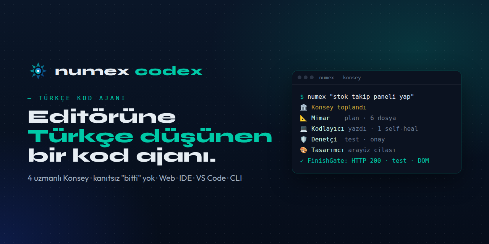
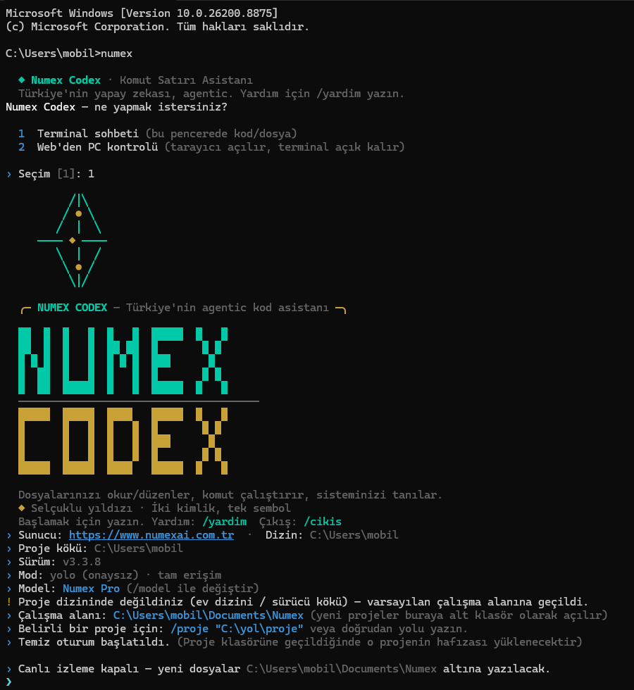
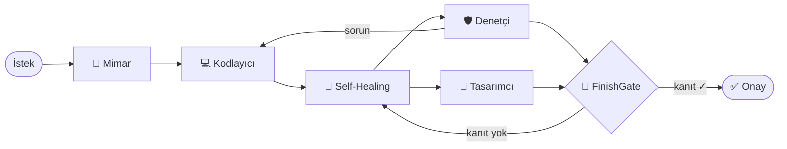
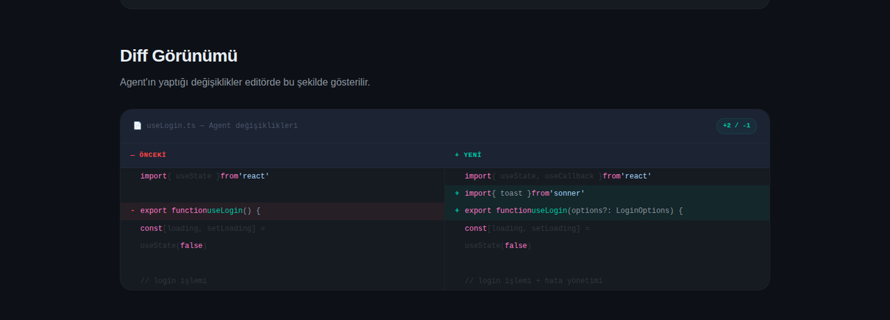
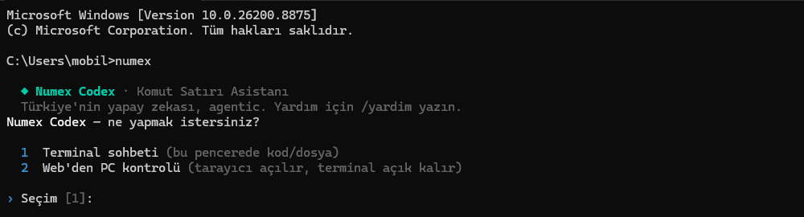

<div align="center">



# Numex Codex

### Editörüne Türkçe düşünen bir kod ajanı.

**İste, yazsın, çalıştırsın — iş bitene kadar.**

[](https://codex.numexai.com.tr)
[](https://codex.numexai.com.tr)
[](https://codex.numexai.com.tr)
[](https://github.com/mobilcep/numex-sdk)

🇹🇷 Türkçe · [🇬🇧 English](README.en.md)

</div>

---

Numex Codex, [Numex AI](https://numexai.com.tr)'ın kod ajanıdır. Ona Türkçe ne istediğini söylersin;
**plan çıkarır, kodu yazar, çalıştırır, test eder** ve ancak çalıştığını **kanıtladığında** "bitti" der.
Karmaşık işlerde tek başına değil, dört uzmandan oluşan bir **Konsey** ile çalışır.

> 📌 Bu depo Numex Codex'in **tanıtım, dokümantasyon ve topluluk** deposudur. Hata bildirimleri,
> öneriler ve tartışmalar burada; sürümler [codex.numexai.com.tr](https://codex.numexai.com.tr)'den
> indirilir. Açık kaynak SDK: [numex-sdk](https://github.com/mobilcep/numex-sdk).

## 📑 İçindekiler

- [Üç kapı, tek ajan](#-üç-kapı-tek-ajan)
- [Hızlı başlangıç](#-hızlı-başlangıç)
- [🏛️ Konsey — 4 uzman, tek görev](#️-konsey--4-uzman-tek-görev)
- [Dört çalışma modu](#-dört-çalışma-modu)
- [Kanıtsız "bitti" yok: FinishGate](#-kanıtsız-bitti-yok-finishgate)
- [Codex IDE](#-codex-ide--numex-çözüm)
- [Codex CLI](#️-codex-cli)
- [Codex Web](#-codex-web)
- [Şeffaf hafıza: `.numex/`](#-şeffaf-hafıza-numex)
- [Güvenlik ve kontrol](#-güvenlik-ve-kontrol)
- [Fiyat](#-fiyat)
- [Dokümanlar](#-dokümanlar)

---

## 🚪 Üç kapı, tek ajan

| | Nerede? | Kurulum | Kimin için? |
|---|---|---|---|
| 🧩 **Codex IDE** | Windows masaüstü | [İndir](https://codex.numexai.com.tr) — v2.9.59, ~162 MB, tamamen Türkçe | Günlük profesyonel geliştirme |
| 🧩 **VS Code eklentisi** | Mevcut VS Code'un | Eklentiyi kur + CLI'ye giriş yap | Alışkanlığını bozmadan |
| ⌨️ **Codex CLI** | Terminal | `npm i -g @numexai/cli` | Terminal, otomasyon, uzak sunucu, CI |
| 🌐 **Codex Web** | Tarayıcı | Yok | Kurulumsuz, "sohbet eder gibi" hızlı proje |

Hepsi aynı **Numex Çekirdeği**'ni kullanır: terminaldeki komut ile editördeki buton birebir aynı
davranır. Programatik erişim için: [Numex SDK](https://github.com/mobilcep/numex-sdk).

## ⚡ Hızlı başlangıç

```console
$ npm i -g @numexai/cli
$ numex login
✓ Giriş başarılı — hoş geldin 👋
$ numex
◇ Numex Codex — Türkçe kod ajanı hazır
```



İlk görevini ver:

```bash
numex "koyu temalı, localStorage kullanan bir yapılacaklar uygulaması yap"
```

---

## 🏛️ Konsey — 4 uzman, tek görev

Çoğu kod ajanı tek bir modelin her şeyi aynı anda yapmasına dayanır: planlar, yazar, test eder ve
"bitti" der — **kendi ödevini kendi notlandıran bir öğrenci** gibi. Codex'te karmaşık işler bir
**Konsey**'e verilir; her üyenin tek bir işi ve sınırlı bir yetkisi vardır.

| Üye | Görevi | Yazabilir mi? |
|---|---|---|
| 📐 **Mimar** | Klasör yapısı, veri modeli, dosya dosya fonksiyon planı | ❌ Sadece plan |
| 💻 **Kodlayıcı** | Plana göre **tam ve çalışan** kodu yazar — iskelet, TODO yok | ✅ **Tek yazıcı** |
| 🛡️ **Denetçi** | Önce *"doğru şeyi mi yaptık?"*, sonra test ve doğrulama | ❌ Sadece test/rapor |
| 🎨 **Tasarımcı** | Arayüz ve kullanıcı deneyimi cilası | ⚠️ Sadece CSS/HTML |



- **Tek yazıcı kuralı:** Kodu yalnızca Kodlayıcı yazar; çakışma imkânsızdır.
- **Konu sapması kontrolü:** Mimar'ın planı isteğinden saparsa Kodlayıcı planı değil **senin isteğini** esas alır.
- **Doğru iş için doğru ekip:** Basit bir düzeltmede konsey toplanmaz; işin büyüklüğüne göre 0, 2, 3 ya da 4 üye çağrılır ve token bütçesi önceden kontrol edilir.
- **Kendin çağır:** *"konseyi topla"*, *"ajanları çağır"*, *"ekibi topla"*, *"hep birlikte bak"*.
- **Dürüst rapor:** Sonunda ne olduğunu düz Türkçe anlatan bir konsey raporu; çözülemeyen sorun varsa açıkça söylenir.

👉 **Ayrıntılı anlatım: [Konsey nasıl çalışır?](docs/konsey.md)**


---

## 🔀 Dört çalışma modu

| Mod | Ne yapar? | Örnek |
|---|---|---|
| 💬 **Sohbet** | Soru-cevap; dosya okur, açıklar, önerir | *"Bu proje ne yapıyor?"* |
| 🗺️ **Plan** | Kod değiştirmeden mimari plan ve adım listesi | *"Ödeme modülü nasıl eklenir?"* |
| 🤖 **Otonom** | Plan → onay → uygula → doğrula döngüsünü kendisi yürütür | *"Testleri yeşile çek"* |
| 🐞 **Hata Avcısı** | Log, terminal çıktısı ve koddan kök nedeni bulur | *"Uygulama açılıyor ama ses yok"* |

Her adım görünür: *"🔍 7 adım · 2 dosya okundu · 2 klasör tarandı · 63 eşleşme"*.

## 🚦 Kanıtsız "bitti" yok: FinishGate

Kod ajanlarının klasik hatası: *"Tamamlandı!"* deyip çalışmayan kod teslim etmek. Codex'te görev
ancak **canlı kanıtla** kapanır:

- ✅ Sunucu gerçekten **HTTP 200** dönüyor mu?
- ✅ **Testler** geçiyor mu?
- ✅ Tarayıcıda **DOM** beklenen öğeleri içeriyor mu? (Omni-Vision: headless tarayıcıyla görsel kontrol)

Kanıt yoksa ajan **Self-Healing** döngüsüne döner: sözdizimi, yapı, veri bütünlüğü ve parantez
dengesi kontrol edilir, hata düzeltilir, tekrar denenir. Ajan takılırsa **StuckDetector** devreye
girip sana ya da web aramasına döner.

---

## 🧩 Codex IDE — "Numex Çözüm"

VS Code tabanlı masaüstü editör. Sağ paneldeki asistanın adı **Numex Çözüm**.

| | |
|---|---|
| ✍️ **Satır içi düzenleme** | `Ctrl+K` → *"bunu async yap"* |
| ⏭️ **Sonraki düzenleme** | Bir değişiklik yaparsın, ilgili sonraki yeri tahmin eder → `Tab` |
| 🔍 **Kod Lens** | Her fonksiyonun üstünde `◆ Numex: … hakkında sor` |
| 🧠 **Anlamsal arama** | *"Ödeme nerede doğrulanıyor?"* — embedding indeksiyle |
| 🖼️ **Görselden arayüz** | Ekran görüntüsü → çalışan kod |
| 🖥️ **Terminal** | Doğal dilden komut üret · terminal çıktısını sohbete gönder |
| 🔀 **Git** | Commit mesajı üret · değişiklikleri AI ile incele · PR aç |
| 🤖 **Ajanlar** | Arka plan ajanı · bulut ajanı · gömülü tarayıcı · Design Mode · Composer |
| 🌍 **Uzak** | SSH ve WSL ile uzak sunucuya bağlan |
| ⚙️ **Ayarlar** | Model & sağlayıcı · sohbet & onay · **Mizah Modu** · RAG · tema · token kullanımı |



Tüm komutlar ve kısayollar: **[docs/komutlar.md](docs/komutlar.md)**

## ⌨️ Codex CLI

```bash
numex                                  # terminal sohbeti
numex "görev"                          # tek seferlik görev
numex plan "ödeme modülü ekle"         # sadece plan, kod değişmez
numex mission "testleri yeşile çek"    # izole çalışma alanında uzun otonom misyon
numex undo                             # son turu tek tıkla geri al
numex --offline "…"                    # yerel Ollama ile internetsiz
/model fast | pro | code               # profili kilitle
```

- ✂️ **Cerrahi yama** — dosyayı baştan yazmaz, diff parçalarıyla hedefli değişiklik
- 🛰️ **Subshell yakalama** — arka plandaki npm/vite/node hatalarını ~2 sn'de yakalar, toparlanır
- 🌳 **Canlı ağaç ilerlemesi** — görev adımları ağaç görünümünde
- 🔎 **BM25 + AST** kod indeksi · 🔌 **MCP** istemcisi (dosya sistemi, git)

### 📱 Uzaktan PC — telefondan bilgisayarına

```bash
numex uzak install    # arka plan köprüsü; terminal kapansa da çalışır, sistem tepsisinde ikon
```

Sonra **numexai.com.tr/developers/remote** sayfasından Google ile giriş yap, yeşil noktalı PC'ni seç,
yaz: klasör oluştur, dosya yaz, komut çalıştır.

| | |
|---|---|
|  |  |


## 🌐 Codex Web

> *"Chat kutusuna ne istediğini yaz. Agent dosyaları otomatik oluşturur, editöre yazar, önizlemeyi
> günceller. Tek buton yok, tek tıklama yok — sadece yaz ve izle."*

- Solda dosya gezgini + **Monaco** editörü, sağda ajan sohbeti, altta terminal, ayrı önizleme
- Şablonlar: Başlangıç · Todo · Hesap · Dashboard · E-ticaret · Blog · Manav
- Hedef platform (Web / API / Masaüstü) ve proje türü (Muhasebe, POS, Oyun, E-ticaret…) seçimi
- Ajan değişiklik kartı: **Kabul Et / Fark / Reddet**
- Kaydet · ZIP indir · URL'den aç · **🚀 Yayınla** — tek tıkla herkese açık adres


---

## 🧠 Şeffaf hafıza: `.numex/`

Codex ne bildiğini ve ne yaptığını gizlemez. Her projede **okunabilir** bir `.numex/` klasörü tutar:
RAG indeksi, **denetim izi** (`audit-trail.jsonl`), geri alma noktaları, öğrenilen hatalar, misyon
durumu ve token kullanımı. Projeye döndüğünde ajan kaldığı yerden devam eder.

👉 [docs/numex-klasoru.md](docs/numex-klasoru.md)

## 🔐 Güvenlik ve kontrol

- **Önce anlaşalım, sonra yapalım:** Otonom modda bile plan sunar ve onay alır.
- **Diff önizleme:** Her değişiklik kabul/ret için gösterilir.
- **Geri alma:** `numex undo`, `.numex/checkpoints`.
- **Denetim izi:** Ajanın çalıştırdığı her komut ve yaptığı her değişiklik kayıtlı.
- **Kendi bilgisayarında:** Ajan dosyalarını senin makinende işler; veriler Türkiye'de, KVKK uyumlu altyapı.

## 💳 Fiyat

| Plan | Codex erişimi |
|---|---|
| Ücretsiz | Temel CLI |
| Başlangıç PRO — ₺99/ay | Tam CLI |
| **Numex PRO — ₺399/ay** | Tam CLI + API, 128K bağlam, öncelikli kuyruk |
| Advanced — ₺599/ay | Tam CLI + tam API, 3 hesap, canlı destek |

Kota bitince **Numex Kredisi**; abonelik istemeyenlere **zaman bileti** (8 saat ₺29'dan).
Güncel fiyatlar: [numexai.com.tr](https://numexai.com.tr).

## 📚 Dokümanlar

| | |
|---|---|
| 🏛️ [Konsey nasıl çalışır?](docs/konsey.md) | 4 uzman, bütçe seviyeleri, FinishGate, konsey raporu |
| ⌨️ [Komutlar ve kısayollar](docs/komutlar.md) | CLI komutları, IDE komut paleti |
| 🧠 [.numex klasörü](docs/numex-klasoru.md) | Ajanın şeffaf hafızası |
| 🌐 [Numex ekosistemi](https://github.com/mobilcep/numex_nedir) | Numex Ailesi'nin tamamı |
| 🧰 [Numex SDK](https://github.com/mobilcep/numex-sdk) | Codex'i kendi kodundan çalıştır |

## 🤝 Topluluk

- 🐞 Hata mı buldun? → [Hata bildir](../../issues/new/choose)
- 💡 Fikrin mi var? → [Özellik isteği](../../issues/new/choose)
- 💬 Codex ile ne yaptın? → [Discussions](../../discussions)
- 🔒 Güvenlik açığı → **destek@numexai.com.tr** (lütfen herkese açık issue açma)

<div align="center">

---

**Numex Codex** · [Numex Ailesi](https://www.numexai.com.tr/aile)'nin geliştirici kapısı<br>
*İnsanı önce koyan Türk yapay zekâsı* 🇹🇷

</div>
