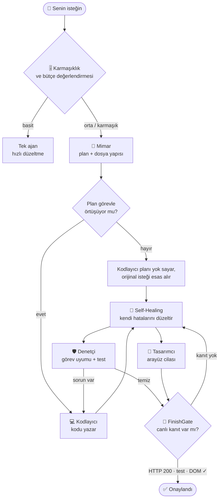

# 🏛️ Numex Konseyi — 4 Uzman, Tek Görev

> *"Kullanıcı tek bir istek atar; arka planda 4 uzman ajan toplanır, tartışır ve kanıtlanmış bir sonuç üretir."*

Çoğu kod ajanı tek bir modelin her şeyi aynı anda yapmasına dayanır: planlar, yazar, test eder ve
"bitti" der. Bu, **kendi ödevini kendi notlandıran bir öğrenciye** benzer. Numex Codex'te karmaşık
işler bunun yerine bir **Konsey**'e (Swarm Council) verilir. Her üyenin tek bir işi ve **sınırlı bir
yetkisi** vardır.

---

## 👥 Konsey üyeleri

| Üye | Görevi | Yetkisi | Yazabilir mi? |
|---|---|---|---|
| 📐 **Mimar** | Klasör yapısını, veri modelini ve dosya listesini çizer; her dosya için fonksiyonları ve parametreleri tek tek planlar | Sadece okuma + plan | ❌ Sadece öneri |
| 💻 **Kodlayıcı** | Mimar'ın planına göre **tam ve çalışan** kodu yazar | Okuma + yazma | ✅ **Tek yazıcı** |
| 🛡️ **Denetçi** | Yazılanı okur, test eder, açıkları bulur, doğrular | Okuma + komut | ❌ Sadece test/rapor |
| 🎨 **Tasarımcı** | Arayüzü ve kullanıcı deneyimini cilalar | Okuma + yazma (yalnızca CSS/HTML) | ⚠️ Sadece arayüz dosyaları |

### Altın kural: aynı anda tek yazıcı
Kodu **yalnızca Kodlayıcı** yazar. Diğerleri okur ve eleştirir; Tasarımcı sadece CSS/HTML'e dokunur,
JavaScript mantığına karışmaz. Böylece iki ajanın aynı dosyayı aynı anda değiştirmesi (race
condition) baştan imkânsızdır.

### Her üyenin "yapmayacağı" da tanımlı
- **Mimar kod yazmaz, doğrulama yapmaz.** Plan yapar ve bitirir. Plan belirsizse bu başarısızlık
  sayılır: *"Vague plan = BAŞARISIZ."*
- **Kodlayıcı boşluğu uydurmaz.** Görev belirsizse kafasından bir proje icat etmek yerine
  *"GÖREV BELİRSİZ: [ne eksik]"* diye durur. Asla iskelet, `TODO` ya da yer tutucu kod bırakmaz.
- **Denetçi dosyalara yazamaz.** Okur ve rapor verir — tarafsız kalması için.
- **Tasarımcı sunucuyu başlatıp durdurmaz**, iş mantığını değiştirmez.

---

## 🔄 Konsey nasıl çalışır?



1. **Değerlendirme.** İstek bir karmaşıklık seviyesine yerleştirilir; kaç üyenin çağrılacağına ve
   token bütçesine göre karar verilir (aşağıdaki tablo).
2. **Plan.** Mimar ayrıntılı bir plan çıkarır.
3. **Konu sapması kontrolü.** Mimar'ın planı gerçekten istenen şey mi? Tek satırlık hızlı bir yapay
   zekâ yargısıyla kontrol edilir. Plan konudan saparsa Kodlayıcı planı görmezden gelir ve **senin
   orijinal isteğini** esas alır.
4. **Yazım + Self-Healing.** Kodlayıcı yazar; sözdizimi, yapı, veri bütünlüğü, parantez dengesi
   kontrol edilir ve Kodlayıcı kendi hatalarını düzeltir.
5. **Denetim ve cila (paralel).** Denetçi test ederken Tasarımcı arayüzü cilalar.
6. **Geri bildirim döngüsü.** Denetçi sorun bulursa iş Kodlayıcı'ya döner. Sonsuz döngüye girmemek
   için tur sayısı sınırlıdır; sınır aşılırsa sana sorulur.
7. **FinishGate.** Görev ancak **canlı kanıtla** kapanır: sunucu HTTP 200 dönüyor, testler geçiyor,
   tarayıcıda DOM beklenen öğeleri içeriyor.

---

## 🎚️ Her iş için doğru ekip

*"Bir el arabası toprak için kepçe + kamyon + formen çağrılmaz."* Konsey, token maliyeti 4 kata
çıkabileceği için sadece gerektiğinde toplanır:

| Seviye | Örnek | Çağrılan üyeler | Düzeltme turu | Tahmini token |
|---|---|---|---|---|
| **Basit (trivial)** | *"başlığı değiştir"* | — (tek ajan) | 0 | ~500 |
| **Kolay** | *"tek dosyada şu fonksiyonu düzelt"* | Kodlayıcı + Denetçi | 1 | ~3.000 |
| **Orta** | Birkaç modüllük özellik | Mimar + Kodlayıcı + Denetçi | 2 | ~7.500 |
| **Karmaşık** | *"frontend + backend + veritabanlı sistem"* | Tam konsey (4 üye) | 2 | ~15.000 |
| **Kurumsal** | *"komple, tüm modüller, mikroservis"* | 4 üye + ek denetim turu | 3 | ~30.000 |

Bütçe yetmiyorsa konsey başlamadan önce söylenir: *"Yetersiz token bütçesi (Kalan: …, Gerekli: …)"*.

### Konsey ne zaman toplanmaz?
- **Hedefli düzeltmede:** *"modal kapanmıyor"*, *"şu butonu düzelt"* → 15 dakikalık senfoni değil,
  neşter.
- **Tek dosyalık işte:** *"tek bir index.html yap"* → tek ajan parça parça yazar.
- **Sadece uzun anlattığında:** Uzun ve samimi bir anlatım (ör. *"kızım için bir org uygulaması…"*)
  tek başına "karmaşık" sayılmaz; gerçek bir teknik karmaşıklık işareti gerekir (mimari, sistem,
  backend, veritabanı…).

### Konseyi kendin çağırmak
İstediğin an konseyi çağırabilirsin — bu, otomatik karmaşıklık kararını atlar:

> *"konseyi topla"* · *"ajanları çağır"* · *"ekibi topla"* · *"takımı çağır"* · *"herkesi topla"* ·
> *"hep birlikte bak"* · *"swarm council"*

Tersine, ayarlardan konsey modunu tamamen kapatabilirsin.

---

## 🛡️ Denetçi'nin ilk sorusu: "Doğru şeyi mi yaptık?"

Temiz kod her zaman doğru kod değildir. Numex'in canlı testlerinde bir *"Proje Sağlık Kontrolü CLI"*
isteğinin tamamen alakasız ama kusursuz yazılmış bir *"Hafıza Kartları"* oyununa dönüştüğü
görülmüştü — ve kod iç tutarlılık açısından mükemmel olduğu için fark edilmemişti.

Bu yüzden Denetçi'nin **ilk** işi, tek bir dosya bile okumadan önce **görev uyum kontrolü**dür:

> *"Kod ne kadar temiz olursa olsun, YANLIŞ ŞEYİN temiz kodu bir BAŞARISIZLIKTIR."*

---

## 📜 Konsey raporu

Her konsey çalışmasının sonunda ne olduğunu düz Türkçe ile anlatan bir özet görürsün:

```
🏛️ Konsey birlikte çalıştı:
Mimar önce bir plan hazırladı, Kodlayıcı bu planı takip etti.
Kodlayıcı uygulamayı yazdı ve 1 self-healing turunda kendi çıkardığı hataları kendi düzeltti.
Denetçi işi inceledi, sorun buldu; Kodlayıcı bunları 1 turda düzeltti, Denetçi tekrar kontrol edip onayladı.
Tasarımcı son olarak arayüzü gözden geçirip cilaladı.
✅ Sonuç: tüm kontroller geçti, onaylandı.
```

Bir şey çözülemediyse bunu da açıkça söyler: *"🚫 Sonuç: 2 sorun hâlâ çözülmeden kaldı, gözden
geçirilmeli."* Numex başarısızlığı başarı gibi göstermez.

---

## 🏗️ Scaffold Konseyi

Sıfırdan yeni bir ürün iskeleti kurulurken aynı dört rolün **iskelet versiyonları** çalışır:
**Scaffold Mimarı**, **Scaffold Kodcusu**, **Scaffold Denetçisi** ve **Scaffold Tasarımcısı**.
Sonuçları tek bir alan şemasında (veri modeli + API + arayüz) birleştirilir.

---

## 🎯 Neden önemli?

| Tek ajan | Numex Konseyi |
|---|---|
| Kendi planını kendi onaylar | Plan, konu sapmasına karşı ayrıca kontrol edilir |
| Kendi kodunu kendi test eder | Yazamayan, tarafsız bir Denetçi test eder |
| "Bitti!" der | FinishGate canlı kanıt ister |
| Her iş için aynı maliyet | İşin büyüklüğüne göre ekip ve bütçe |
| Ne yaptığı belirsiz | Düz Türkçe konsey raporu + `.numex/audit` kaydı |

---

← [Ana sayfa](../README.md) · [Komutlar](komutlar.md) · [.numex klasörü](numex-klasoru.md)
